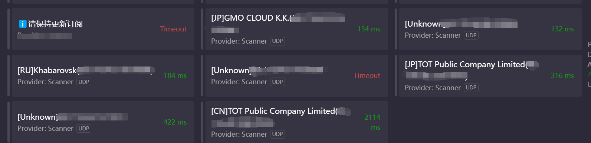

# ProxyScan

很多配网小子喜欢在路由器上配代理，同时把 WAN 方向的访问打开了，尤其是在高校网段。

因此编写了这样一个工具来警醒各位正确配置防火墙的重要性。



# Start

```shell
go install github.com/hdu-dn11/proxyScan@latest
sudo proxyScan -prefix 0.0.0.0/0 -pcap -report
```

`-pcap` 模式需要 root 权限。`-report` 选项会连接到扫描出的代理，做一下对 `cloudflare` 的测速和不同方向的 `ip` 出口测试。

建议在 Linux 上运行，效率比 windows 上高十倍起码。

# 兼容性

**NO WINDOWS XP OR EARLIER VERSIONS SUPPORTED**

不支持 Windows XP 及更早版本

# 测速

测速基准：腾讯云上海2c2g SA5 100Mbps pcap 模式 无速率限制 每个 IP 扫 9 个常用端口

由于长时间跑会被限速，因此跑 /12 直接换算 /0 时间，约为 54 小时
